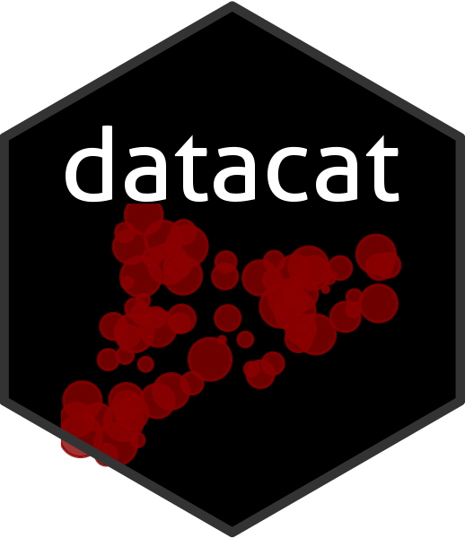

<!-- README.md is generated from README.Rmd. Please edit that file -->

```{r, include = FALSE}
knitr::opts_chunk$set(
  collapse = TRUE,
  comment = "#>",
  fig.path = "man/figures/README-",
  out.width = "100%",
    warning = FALSE, 
   message = FALSE, 
   error = TRUE, 
   cache = FALSE
)
```

```{r, echo = FALSE}
# Generate hex sticker
# On linux, there are some non-R prerequistes:
# - sudo apt install libmagick++-dev
# - https://tecadmin.net/install-imagemagick-on-linux/

library(hexSticker)
library(ggplot2)
library(extrafont)
library(sp)
library(raster)
library(ggthemes)
library(dplyr)
extrafont::loadfonts(quiet = TRUE)

# Get Catalonia
catalonia <- getData(country = 'ESP', level = 1)
catalonia <- catalonia[catalonia@data$NAME_1 == 'Cataluña',]
cataloniaf <- fortify(catalonia)

# Get some points
n <- 150
rangey <- bbox(catalonia)
xs <- sample(seq(rangey[1,1],
                 rangey[1,2],
                 length = 10000),
             n)
ys <- sample(seq(rangey[2,1],
                 rangey[2,2],
                 length = 10000),
             n)
df <- tibble(x = xs,
             y = ys) %>%
  mutate(lng = x,
         lat = y)
dfsp <- df
coordinates(dfsp) <- ~x+y
proj4string(dfsp) <- proj4string(catalonia)
# Keep only points in Cat
keep <- over(dfsp, polygons(catalonia))
dfsp <- dfsp[!is.na(keep),]
df <- dfsp@data
df$size <- runif(n = nrow(df), min = 0, max = 6)

p <- ggplot() +
  geom_point(data = df,
             aes(x = lng,
                 y = lat,
                 size = size),
             alpha = 0.8,
             color = 'darkred')
  # geom_polygon(data = cataloniaf,
  #              aes(x = long,
  #                  y = lat,
  #                  group = group),
  #              fill = 'lightblue')
p <- p + theme_map() +  theme_void() + theme_transparent() + 
  scale_size_area(max_size = 5) +
  theme(legend.position = 'none')
if(!dir.exists('man')){
  dir.create('man')
}
if(!dir.exists('man/figures')){
  dir.create('man/figures')
}

sticker(p, package="datacat", 
        # p_family = 'Lato',
        p_size = 30,
        s_x=1, 
        s_y=.75, 
        s_width=1.3, 
        s_height=1,
        p_color = "white",
        h_color = '#333333',
        h_fill = "#000000",
        spotlight = FALSE,
        filename="man/figures/logo.png")
```

# datacat <a href='https://github.com/joebrew/hepfi'></a>

<!-- badges: start -->
[](https://www.tidyverse.org/lifecycle/#experimental)
<!-- badges: end -->

`datacat` is a tool for data-driven journalism in Catalonia.

## Installation

You can install datacat from github by running the following:

``` r
devtools::install_github('joebrew/datacat')
```

## Development

In order to build this package and run the application correctly, one should:

1. Clone this repository: `git clone https://github.com/joebrew/datacat`.  
2. `cd` into `data-raw`


